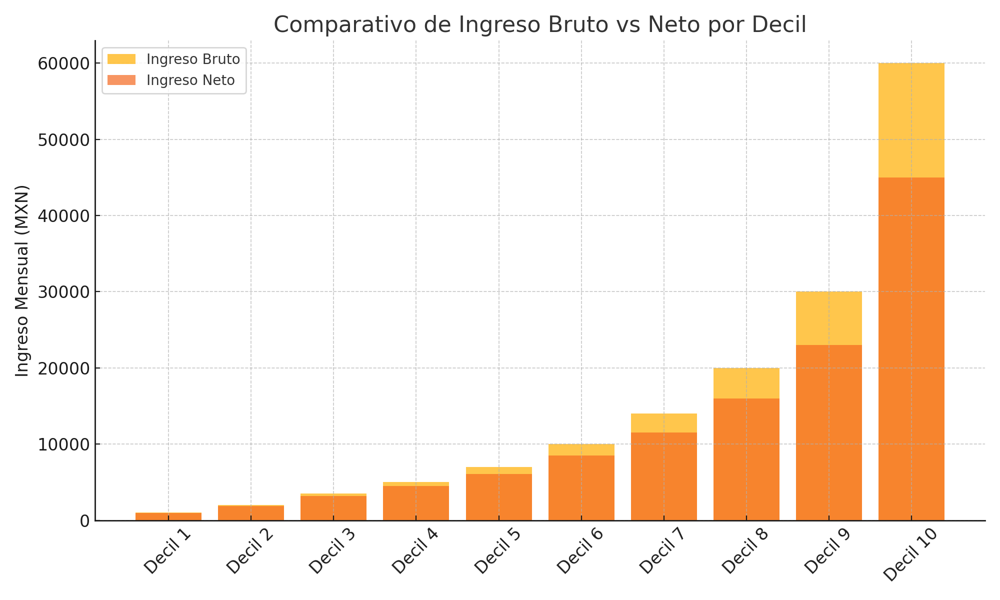
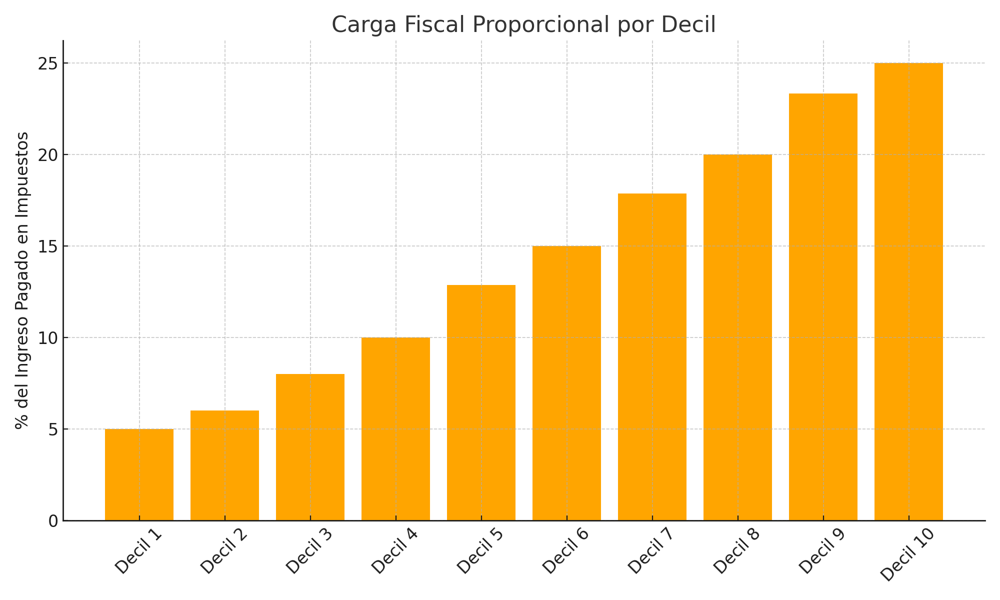

# ¿Quién gana más y quién paga más impuestos en México?

Este análisis explora los ingresos de los hogares mexicanos por deciles (del 10% más pobre al 10% más rico) y cuánto pagan en impuestos, con datos simulados inspirados en la ENIGH 2022 y estudios del CIEP.

## 📊 Visualización del análisis

### Comparativo de ingreso bruto vs ingreso neto por decil

### Carga fiscal proporcional por decil

## 📈 Datos utilizados

El archivo de Excel contiene:
- Ingresos mensuales promedio por decil
- Impuestos pagados (simulados)
- Cálculo de ingreso neto
- % del ingreso destinado a impuestos
- Gráficas generadas directamente desde Excel

📂 Archivo: `analisis_ingresos_impuestos_mexico.xlsx`

## 💡 Conclusiones

- El decil más rico gana hasta **60 veces más** que el más pobre.
- Pero en términos proporcionales, los impuestos **no siempre son progresivos**.
- Esto sugiere que el sistema fiscal **no reduce la desigualdad tanto como se pensaría.**

---

📬 ¿Comentarios, sugerencias o colaboraciones? ¡Bienvenido!
